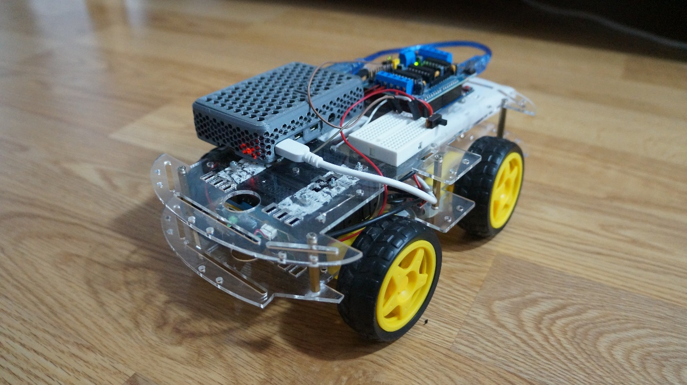

# Depth-Car
**Depth-Car** _A four wheel drive car with _monocular depth estimation.__

<a href="https://github.com/KozhaAkhmet/depth-car/wiki">
<strong> Read the docs » </strong></a>

<a href="https://drive.google.com/file/d/1z04SJp82yfzTh-r0C52tlgdDI_OQD_8m/view?usp=sharing">
<strong> Read the Thesis (in Turkish) » </strong></a>

## About the Project

Depth Car is an autonomous car with Monocular depth estimation using MiDAS, TensorFlow Lite and OpenCV on The Raspberry Pi 4, written in C++.

This project uses Midas Depth Estimation as a core part of the project. I suggest checking it out before proceeding with this project.
 
There is an example repository that explains the model and installation steps. The repository is available at [Midas Cpp Example](https://github.com/KozhaAkhmet/MiDaS-v2.1-small-cpp).

The detection uses a simple algorithm, which extracts a particular layer from the calculated estimation and stores it as a binary image. The robot then calculates whether to move left or right by calculating and analyzing the number of pixels on the image.

The aim of the project is to achieve a simple yet fast solution suitable to run on Raspberry Pi 4+ devices using C++ only. This project is developed as my bachelor's degree graduation project **"Deep Learning and Its Application"**. The thesis is in Turkish and available [here](https://drive.google.com/file/d/1z04SJp82yfzTh-r0C52tlgdDI_OQD_8m/view?usp=sharing) 

## Results

This project is tested on Raspberry Pi 4 Model B with 4 GB RAM with the 64-bit Ubuntu 22.04 without overclocking. Used a 3A power supply. Here are the results:

| Device         | RAM  | OS     | Multithread(All) Performance | Single Thread Performance |
| -------------- | ---- | ------ | ---------------------------- | ------------------------- |
| Raspberry Pi 4 | 4 GB | Ubuntu | ~ 2.3 FPS                   | ~ 0.91 FPS                |

https://github.com/KozhaAkhmet/depth-car/assets/80167990/6c15b464-dc7b-41f7-bc2a-608e26f3cbc1

## Installation

You can follow the instructions in [docs](https://github.com/KozhaAkhmet/depth-car/wiki/Software-Installation)

## License
Licensed under the [GNU General Public License](https://github.com/KozhaAkhmet/depth-car/blob/main/LICENSE).

## Contact

**Depth-Car** _A four wheel drive car with _monocular depth estimation.__

The original thesis is in Turkish and available [here](https://drive.google.com/file/d/1z04SJp82yfzTh-r0C52tlgdDI_OQD_8m/view?usp=sharing) 

<i>Developed by <a href="https://github.com/KozhaAkhmet">Kozha Akhmet Abdramanov</a>

* Robot Car with Depth Estimation Source Code: 
[KozhaAkhmet/depth-car](https://github.com/KozhaAkhmet/depth-car)
* Midas in C++ Source Code: 
[KozhaAkhmet/MiDaS-v2.1-small-cpp](https://github.com/KozhaAkhmet/MiDaS-v2.1-small-cpp)

Feel free to contact me from my email address: [kozha.akhmt@gmail.com](mailto:kozha.akhmt@gmail.com).

